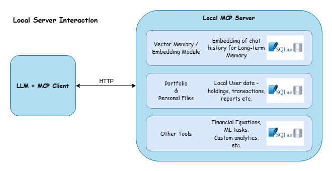
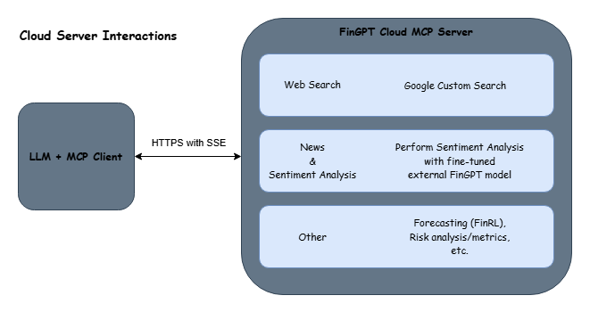

Overview
===================================================

**FinGPT-Powered Agents** are agents that leverage the FinGPT and MCP protocol framework.
The MCP protocol is a standardized modular design for a LLM to communicate with other servers.
This communication is done through the MCP server, which is a server that listens for incoming requests and sends responses back to the LLM.
Responses back to the LLM give the LLM access to necessary context to complete the task.

**FinGPT-Agent Local MCP Server:**

The local FinGPT MCP server example shows a basic implementation of the MCP protocol.
The LLM and Client send requests to this local server, which will provide context to the LLM.
Context can include information from the last messages between user and LLM, information from
personal files, and extra finance tools. 

**FinGPT-Agent Cloud MCP Server:**

The FinGPT cloud MCP server example presents MCP protocol cloud server.
The LLM and Client send requests to this server through HTTPS with SSE and context is sent back to the LLM.
The MCP server can take these requests and in this example has the ability to
search the web, analysis of current data through other models, and access to tools and data based
on the agents job.

**External API / MCP Servers:**
One of the best parts about MCP is its modularity. Since this standardized framework is quickly growing
there are many mcp servers that have already been created for APIs. For example YahooFinance API has multiple
public MCP servers that can be added to FinGPT-Agents to help provide necessary context to the LLMs. Since this
is the case we will leave the API servers as a separate addons to our standard FinGPT MCP servers.