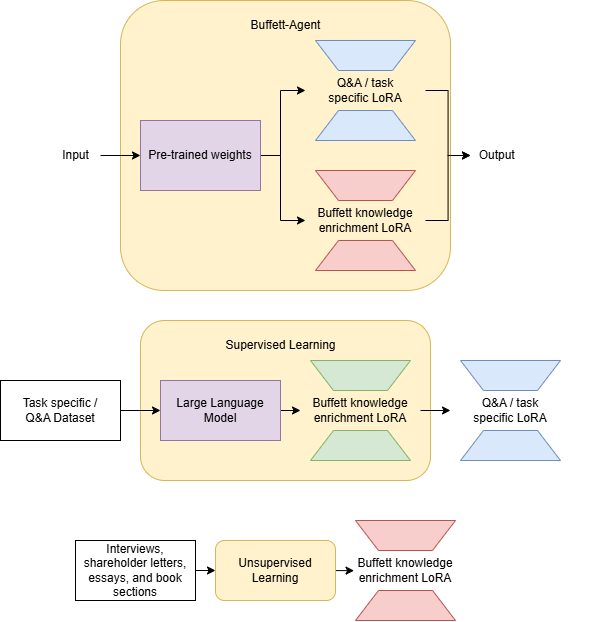
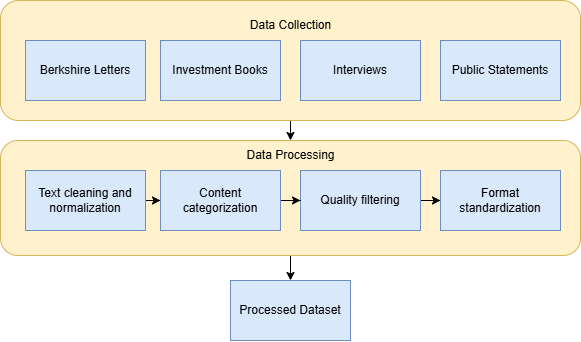

# Buffett Agent

## Leveraging FinLoRA to build an avatar of Warren Buffet.

## Background

With the growing industry of LLMs and models growing at an immense rate, fine-tuning has become a necessity to specialize general models for specific complex tasks. While fine-tuning is still more efficient and cost effective than normal training, parameter efficient methods have shown to provide high scores and huge efficiency boosts to normal fine-tuning. 

Starting with FinLLMs like BloombergGPT presenting the potential for LLMs in finance. Then improvements on this by fine-tuning existing models FinGPT showed large progress in the space. Lastly, FinLoRA showing Low-Rank Adaptation presents a massive increase in efficiency and costs while retaining high scores on financial datasets.

Using a method like LoRA we generate a model to try and match the knowledge of the legendary investor Warren Buffett to give finacial advice. 

## System Architecture

### Overview


### Data Collection Pipeline


### Fine-tuning Architecture


## Features

- Fine-tuned on Warren Buffett's investment philosophy and writings
- Uses parameter-efficient LoRA adaptation technique
- Trained on annual letters, books, and interviews
- Specialized in value investing principles and financial analysis

## Data Sources

The model is trained on carefully curated data from:
- Warren Buffett's annual letters to Berkshire Hathaway shareholders
- Books written about Warren Buffett's investment strategies
- Scraped interviews and public statements
- Custom question sets for investment analysis

## Project Structure

```
FinLoRA-Agent/
├── data/
│   ├── books/
│   ├── scrape/
│   ├── question_sets/
│   └── warren_buffet_letters/
├── src/
│   ├── test/
│   └── train/
├── LICENSE
└── README.md
```


## Model Fine-tune Approach

The model uses LoRA (Low-Rank Adaptation) to efficiently fine-tune a base language model with Warren Buffett's investment knowledge. This approach:
- Reduces training costs significantly compared to full fine-tuning
- Maintains model performance while being parameter-efficient
- Allows for quick adaptation to specific financial domains


## License

This project is licensed under the terms of the LICENSE file included in the repository.


## Acknowledgments

- Warren Buffett's decades of investment wisdom and public teachings
- The FinLoRA paper and implementation
- The Fin AI community 


This is not financial advice use at your own risk.
